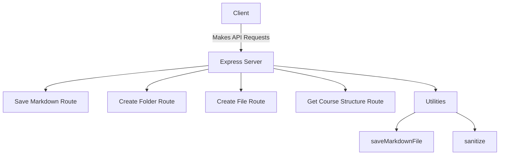

# Architecture

The `markdown-backend` is built using Node.js and the Express framework, providing a robust and scalable architecture for handling HTTP requests. Below is an overview of its key components:

## Core Components

1. **Express Server**:
   - The application is structured around an Express server that listens for incoming requests and routes them to the appropriate handlers.

2. **Routing**:
   - The backend defines several API endpoints for various functionalities:
     - **Save Markdown**: Handles saving markdown files.
     - **Create Folder**: Manages the creation of directories.
     - **Create File**: Manages the creation of files.
     - **Get Course Structure**: Retrieves the folder and file structure.

3. **Middleware**:
   - The application uses middleware for:
     - CORS: To allow cross-origin requests.
     - JSON Parsing: To handle incoming JSON payloads.

4. **Utilities**:
   - Utility functions are provided to support file operations, such as saving markdown files and sanitizing filenames.

## Architecture Diagram

1. **Client Request**:
   - Clients send HTTP requests to the defined API endpoints.

2. **Request Handling**:
   - The Express server routes the requests to the appropriate handler based on the endpoint.

3. **File Operations**:
   - The backend performs necessary file operations using the `fs` module, such as creating folders and writing files.

4. **Response**:
   - The server sends back a response to the client, indicating the success or failure of the requested operation.
